# Дослідження методу Градієнтного Спуску (ГС) для розв'язання задачі мультилатерації (TDoA)
## Бучко Вікторія ІПЗ-4.02

---

## Мета
- Практично реалізувати та дослідити роботу алгоритму градієнтного спуску.
- Зрозуміти суть Методу Найменших Квадратів (МНК) як способу формулювання функції втрат.
- Візуалізувати та проаналізувати ключові параметри оптимізації: learning rate, noise level, initial guess.
- Дослідити інженерні трейдофи та проблему Геометричного Послаблення Точності (GDOP).

---

## Частина 1: Ознайомлення з кодом

**Блок 1.** Налаштування експерименту. Містить усі параметри: BASE_STATIONS, TRUE_POSITION, NOISE_LEVEL, LEARNING_RATE, MAX_ITERATIONS, TOLERANCE, INITIAL_GUESS.

**Блок 2.** Генерація вхідних даних. Функція calculate_ideal_tdoa розраховує ідеальні TDoA, після чого до них додається випадковий шум для симуляції реальних вимірів.

**Блок 3.** Функція втрат (МНК). loss_function обчислює суму квадратів похибок між розрахованими і виміряними різницями відстаней.

**Блок 4.** Оптимізатор (ГС). gradient_descent_optimizer реалізує градієнтний спуск з чисельним градієнтом. Зупиняється або при досягненні TOLERANCE, або при вичерпанні MAX_ITERATIONS.

**Блоки 5–7.** Запуск та візуалізація. Будуються 4 графіки: крива навчання, шлях оптимізації у 2D, величина градієнта, delta loss.

---

## Завдання 1: Контрольний запуск ("Ідеальний світ")

**Параметри:**
- `NOISE_LEVEL = 0`
- `LEARNING_RATE = 0.01`
- `INITIAL_GUESS = [50000, 50000]`
- `TRUE_POSITION = [45000, 35000]`

**Результати:**
- Збіжність досягнута на ітерації: 433
- Похибка позиціонування: 0.00 м(менше 0.005 м через округлення)

### Відповіді на питання

**Питання 1. Чому похибка не дорівнює 0 без шуму?**
Навіть при відсутності шуму алгоритм не доходить до ідеально точної точки, тому що він зупиняється раніше у той момент, коли зміна функції втрат між ітераціями стає меншою за заданий поріг TOLERANCE. Це означає, що алгоритм припиняє роботу не тоді, коли знайдено абсолютно точний розв’язок, а коли подальші покращення вже дуже малі. Тому координата виходить максимально близькою до істинної, але не математично ідеальною. У нашому випадку похибка просто настільки маленька, що після округлення виглядає як 0.00 м

**Питання 2. Як пов'язані графіки градієнта і Loss?**
Обидва графіки падають одночасно і мають однакову форму кривої. Градієнт показує наскільки крутий схил функції втрат в поточній точці. Поки алгоритм далеко від мінімуму - схил крутий, градієнт великий і Loss падає великими стрибками. Коли наближається до дна - схил вирівнюється, градієнт зменшується і Loss майже перестає змінюватись. Тому обидві криві мають однакову форму на логарифмічній шкалі

---

## Завдання 2: Дослідження learning_rate ("Проблема Золотоволоски")

**Параметри (спільні):**
- `NOISE_LEVEL = 1e-6`
- `TRUE_POSITION = [45000, 35000]`
- `INITIAL_GUESS = [50000, 50000]`

### Експеримент 2a. LEARNING_RATE = 2.0 (Розбіжність)

**Результати:** Не збігся за 100 000 ітерацій. Похибка: 792807.19 м.

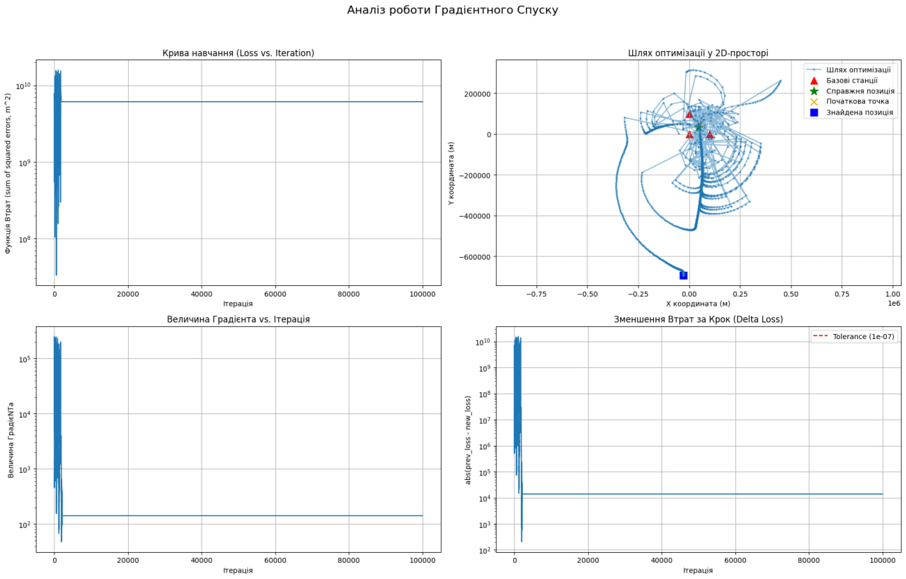

### Експеримент 2b. LEARNING_RATE = 1e-5 (Стагнація)

**Результати:** Не збігся за 100 000 ітерацій. Похибка: 196.79 м.

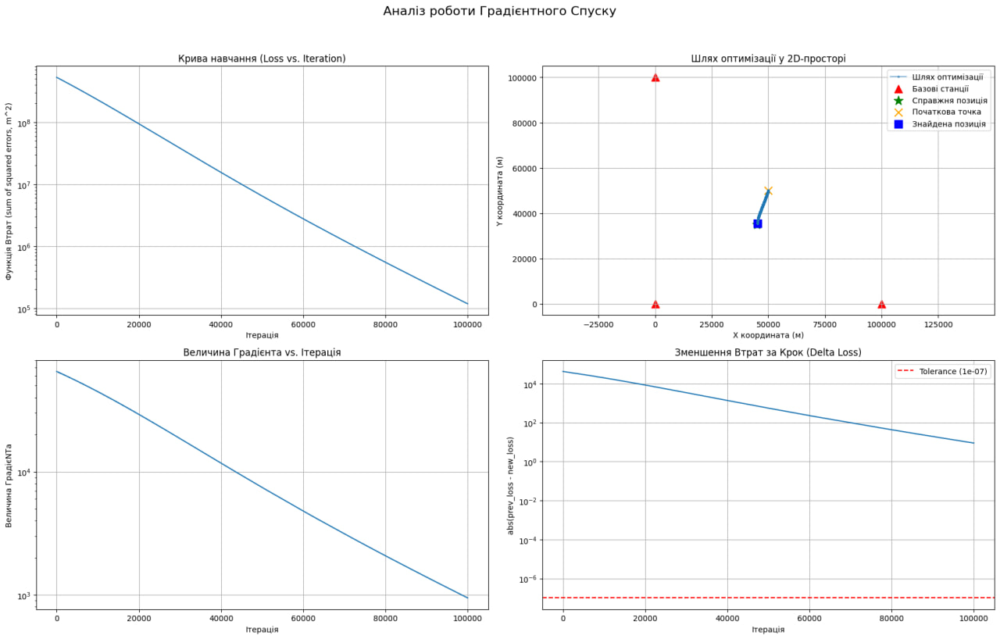

### Експеримент 2c. LEARNING_RATE = 0.01 (Оптимальний)

**Результати:** Збіжність на ітерації 433. Похибка: 72.18 м.

### Відповіді на питання

**2a. Що сталося з Loss? Що таке розбіжність?**
При занадто великому значенні learning rate функція втрат поводиться нестабільно і не зменшується як треба. Алгоритм робить надто різкі кроки і перелітає через мінімум, не встигаючи в нього потрапити. Через це він не наближається до правильної точки, а навпаки відходить від неї все далі. На 2D-графіку це проявляється як великі нерівні стрибки замість плавного руху до цілі. Таку ситуацію називають розбіжністю - коли метод не може зійтися до розв’язку через невдалий вибір параметра навчання

**2b. Чи зійшовся алгоритм? Що таке стагнація?**
Алгоритм не зійшовся за задану кількість ітерацій, хоча рухався у правильному напрямку. Функція втрат зменшується дуже повільно і за відведений час не досягає мінімуму. У порівнянні з нормальним режимом крива Loss майже пряма з невеликим спадом. Така поведінка називається стагнацією - коли алгоритм працює правильно, але через малі кроки рухається занадто повільно

**Чому learning_rate є найважливішим параметром?**
Learning rate визначає розмір кроку на кожній ітерації. Якщо він занадто великий - алгоритм не сходиться, якщо занадто малий - навчається дуже повільно. Інші параметри впливають на старт або зупинку, але саме learning rate визначає, чи буде алгоритм стабільно і ефективно рухатися до мінімуму

---

## Завдання 3: Дослідження NOISE_LEVEL ("Сміття на вході - сміття на виході")

**Параметри (спільні):**
- `LEARNING_RATE = 0.01`
- `TRUE_POSITION = [45000, 35000]`
- `INITIAL_GUESS = [50000, 50000]`

### Експеримент 3a. NOISE_LEVEL = 1e-9

**Результати:** Збіжність на ітерації 433. Похибка: 0.16 м.

### Експеримент 3b. NOISE_LEVEL = 1e-6

**Результати:** Збіжність на ітерації 433. Похибка: 373.90 м.

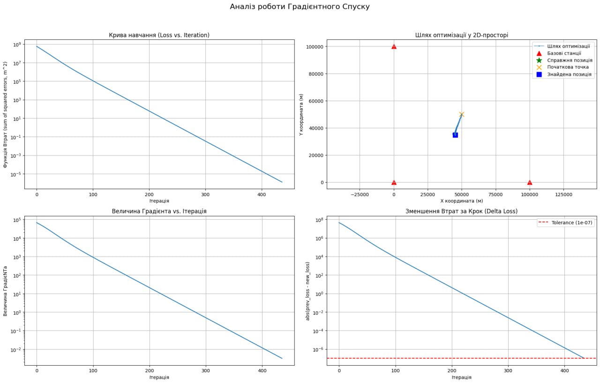

### Експеримент 3c. NOISE_LEVEL = 1e-4

**Результати:** Збіжність на ітерації 446. Похибка: 9999.98 м.

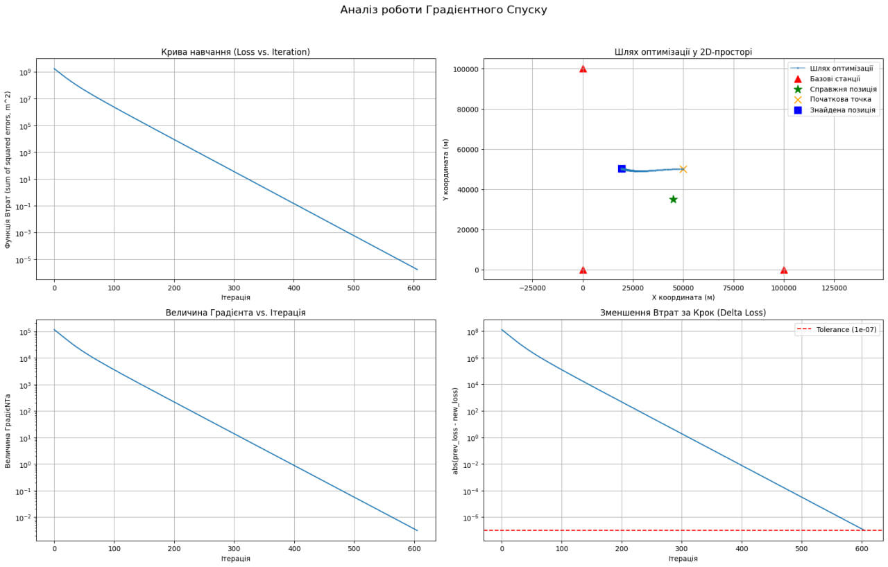

### Відповіді на питання

**Питання 1. Таблиця результатів:**

| NOISE_LEVEL (с) | Noise (м) | Фінальна похибка (м) |
|---|---|---|
| 1e-9 | 0.3 | 0.16 |
| 1e-6 | 300 | 373.90 |
| 1e-4 | 30000 | 9999.98 |

З результатів видно, що зі збільшенням шуму у вхідних даних зростає і похибка визначення координати. Це логічно, оскільки алгоритм працює з вимірюваннями, і якщо вони неточні, то і результат буде неточним. Залежність фактично пряма: чим більша помилка у вимірах часу, тим сильніше зміщується обчислена позиція

**Питання 2. Чому в 3c алгоритм збігся, але похибка велика?**
Алгоритм мінімізує функцію втрат для тих даних, які отримує на вході. Якщо ці дані сильно зашумлені, то правильна з точки зору математики відповідь буде відповідати саме цим помилковим даним. Тобто він знаходить не реальну позицію, а ту точку, яка найкраще узгоджується із зашумленими вимірюваннями. Тому графік Loss зменшується і алгоритм сходиться, але до мінімуму “неправильної” функції, сформованої на основі шуму

---

## Завдання 4: Дослідження INITIAL_GUESS ("Вплив початкової точки")

**Параметри (спільні):**
- `NOISE_LEVEL = 1e-6`
- `LEARNING_RATE = 0.01`
- `TRUE_POSITION = [45000, 35000]`

### Експеримент 4a. INITIAL_GUESS = [50000, 50000]

**Результати:** Збіжність на ітерації 435. Похибка: 204.21 м.

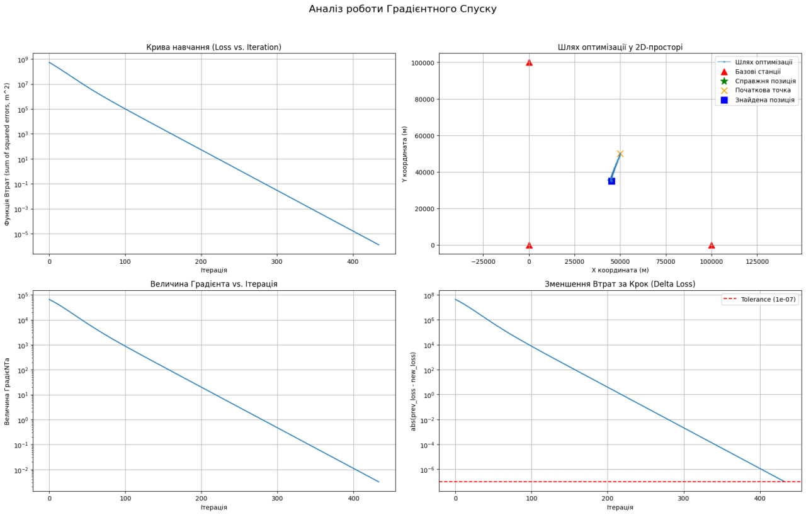

### Експеримент 4b. INITIAL_GUESS = [0, 0]

**Результати:** Збіжність на ітерації 369. Похибка: 210.76 м.

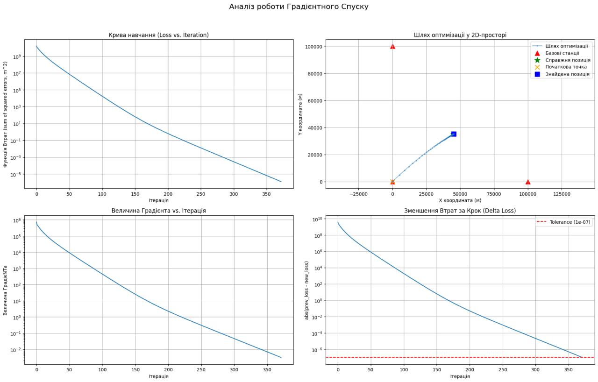

### Експеримент 4c. INITIAL_GUESS = [-500000, -500000]

**Результати:** Не збігся за 100 000 ітерацій. Похибка: 967582.92 м.

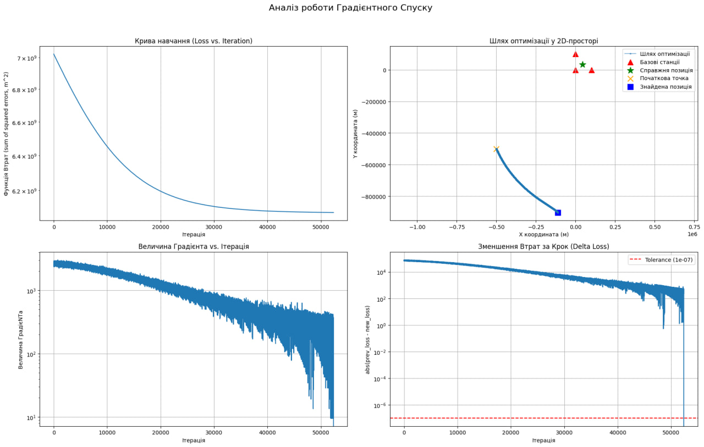

### Відповіді на питання

**Питання 1. Порівняння кількості ітерацій:**

| Експеримент | INITIAL_GUESS | Ітерацій | Фінальна похибка (м) |
|---|---|---|---|
| 4a | [50000, 50000] | 435 | 204.21 |
| 4b | [0, 0] | 369 | 210.76 |
| 4c | [-500000, -500000] | 100000 | 967582.92 |

Коли початкова точка знаходиться близько до правильного розв’язку, алгоритм сходиться швидко. Якщо стартова точка далі, потрібно більше ітерацій. У випадку дуже далекого старту алгоритм може просто не встигнути дійти до мінімуму за обмежену кількість ітерацій

**Питання 2. Чи вплинула початкова точка на точність?**
Початкова точка майже не впливає на фінальну точність, якщо алгоритм встигає зійтися. Це пов’язано з тим, що функція втрат у цій задачі має один глобальний мінімум, і незалежно від старту алгоритм рухається саме до нього. Різниця полягає тільки у швидкості, з якою він туди приходить. У випадку дуже поганого старту точність виявилась низькою не через сам старт, а через те, що алгоритм не встиг завершити збіжність

---

## Завдання 5: Дослідження геометрії ("Прокляття плаского каньйону" - GDOP)

**Параметри (спільні):**
- `NOISE_LEVEL = 1e-6`
- `LEARNING_RATE = 0.01`
- `INITIAL_GUESS = [50000, 50000]`

### Експеримент 5a. TRUE_POSITION = [45000, 35000] (Хороша геометрія)

**Результати:** Збіжність на ітерації 432. Похибка: 417.11 м.

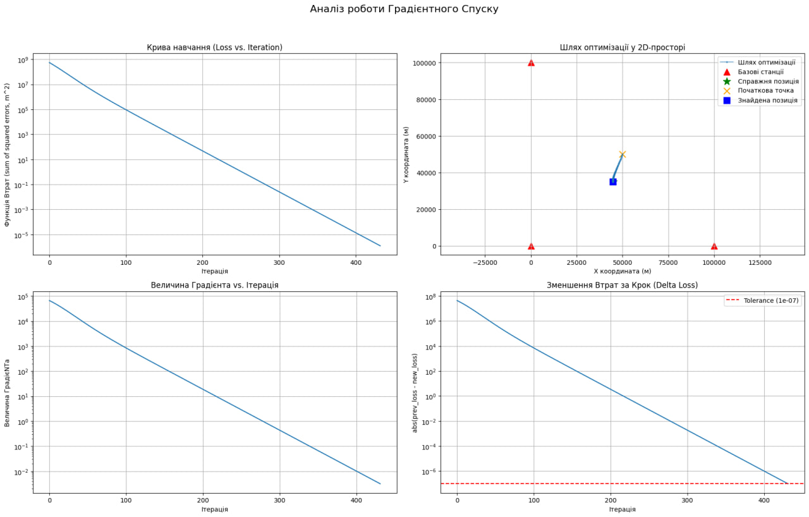

### Експеримент 5b. TRUE_POSITION = [45000, -135000] (Погана геометрія)

**Результати:** Не збігся за 100 000 ітерацій. Похибка: 8076.03 м.

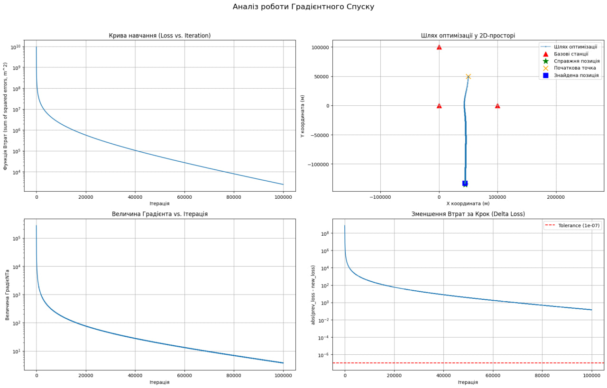

### Відповіді на питання

**Питання 1. Чому похибки відрізняються при однаковому шумі?**

| Експеримент | TRUE_POSITION | Похибка (м) |
|---|---|---|
| 5a | [45000, 35000] | 417.11 |
| 5b | [45000, -135000] | 8076.03 |

Різниця пояснюється геометрією розташування станцій відносно цілі. Коли ціль знаходиться всередині області між станціями, перетини гіпербол відбуваються під хорошими кутами, і навіть за наявності шуму координата визначається досить точно. Коли ж ціль знаходиться далеко збоку, всі вимірювання приходять майже з одного напрямку, і лінії перетину стають майже паралельними. У такій ситуації навіть невелика помилка у вимірах призводить до великої похибки в координатах

**Питання 2. Чому алгоритм зупинився при великій похибці в 5b?**
У цьому випадку функція втрат має дуже пологу форму, схожу на довгу рівну долину. Уздовж цієї області значення Loss змінюється дуже повільно, тому градієнт стає малим. Алгоритм бачить, що покращення майже немає, і або зупиняється за умовою, або просто витрачає всі ітерації без значного прогресу. Тобто він не “розуміє”, куди рухатись далі, бо поверхня виглядає майже однаково у великій області

---

## Завдання 6 (Бонус): Дослідження TOLERANCE ("Ціна точності")

**Параметри (спільні):**
- `NOISE_LEVEL = 1e-6`
- `LEARNING_RATE = 0.01`
- `TRUE_POSITION = [45000, -135000]`
- `INITIAL_GUESS = [50000, 50000]`
- `MAX_ITERATIONS = 100000`

### Експеримент 6a. TOLERANCE = 1e-2

**Результати:** Не збігся за 100 000 ітерацій. Похибка: 759.24 м.

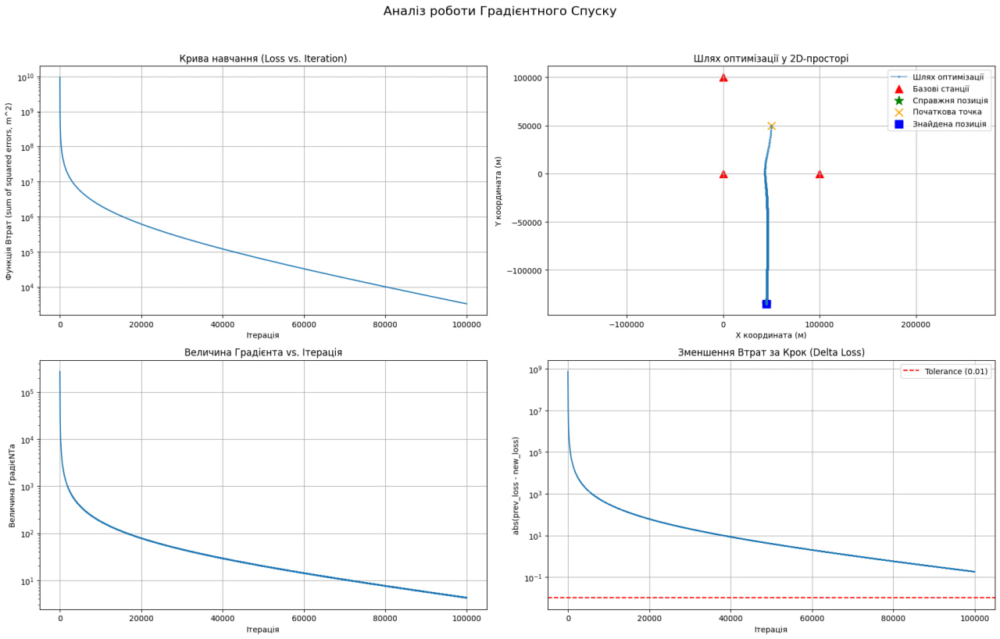

### Експеримент 6b. TOLERANCE = 1e-7

**Результати:** Не збігся за 100 000 ітерацій. Похибка: 8491.85 м.

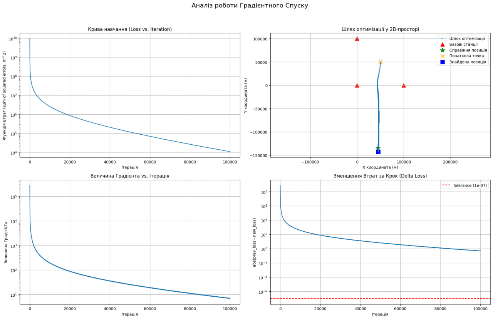

### Експеримент 6c. TOLERANCE = 1e-12

**Результати:** Не збігся за 100 000 ітерацій. Похибка: 1921.40 м.

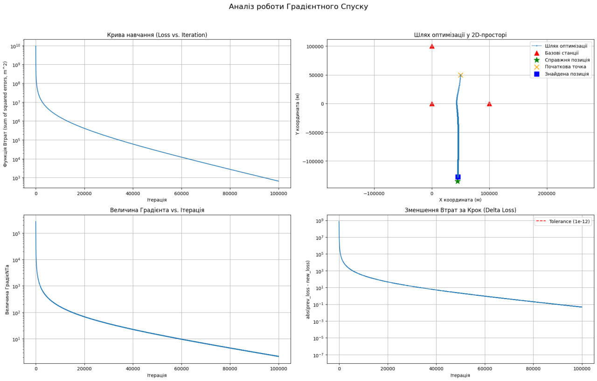

### Відповіді на питання

**Питання 1. Порівняння трьох експериментів:**

| Експеримент | TOLERANCE | Ітерацій | Фінальна похибка (м) |
|---|---|---|---|
| 6a | 1e-2 | 100000 | 759.24 |
| 6b | 1e-7 | 100000 | 8491.85 |
| 6c | 1e-12 | 100000 | 1921.40 |

У всіх трьох випадках алгоритм використав максимальну кількість ітерацій і не досяг формального критерію збіжності. Значення похибки відрізняються, але це не означає, що tolerance безпосередньо покращує точність. Різниця пов’язана з тим, що при кожному запуску генерується новий випадковий шум, тому оптимум функції втрат зміщується.

**Питання 2. Чи варто платити ітераціями за менший tolerance?**
Зменшення tolerance змушує алгоритм довше працювати, але не вирішує головні проблеми. Якщо дані зашумлені або геометрія невдала, алгоритм все одно буде сходитися до неправильного або неточного розв’язку. Тобто можна витратити значно більше ітерацій, але не отримати принципово кращий результат. Тому зменшення tolerance має сенс лише тоді, коли сама задача добре обумовлена і дані достатньо точні

---

## Загальний висновок

На роботу градієнтного спуску найбільше впливають три речі. Перше - learning rate: якщо він неправильний, алгоритм або розлітається, або стоїть на місці. Друге - шум у вхідних даних: алгоритм знаходить мінімум, але якщо дані зашумлені, то цей мінімум не відповідає реальній позиції. Третє - геометрія станцій: якщо ціль далеко збоку від усіх станцій, навіть малий шум дає велику похибку і алгоритм застрягає на пласкому дні функції втрат

Initial guess і Tolerance менш критичні. Вони впливають на кількість ітерацій, але не рятують від поганих даних чи поганої геометрії.
